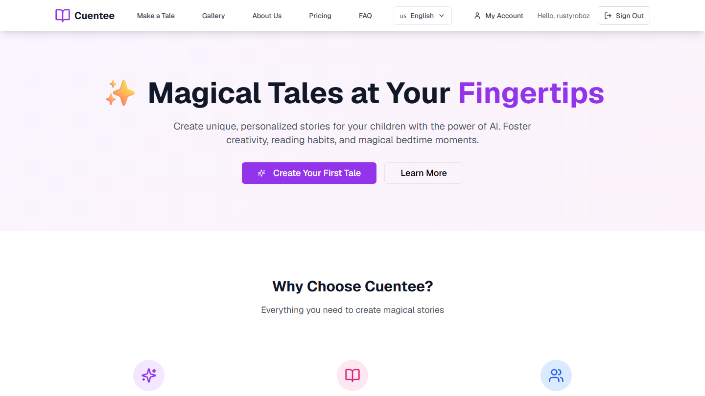
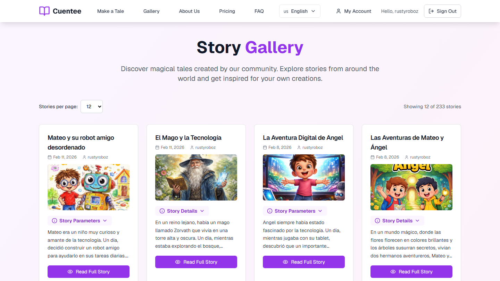
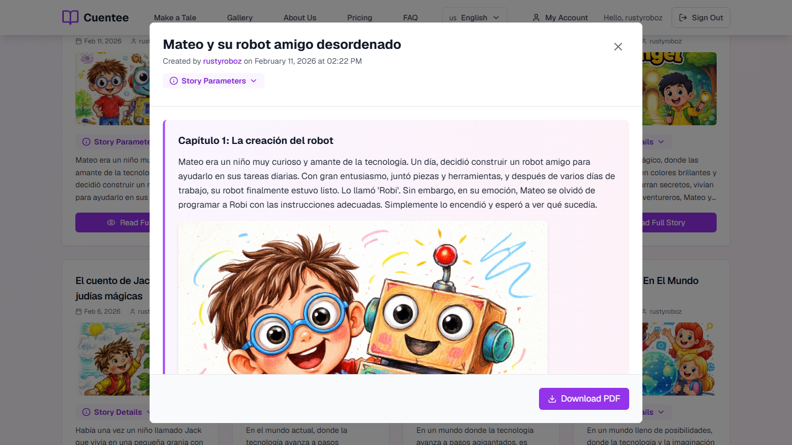
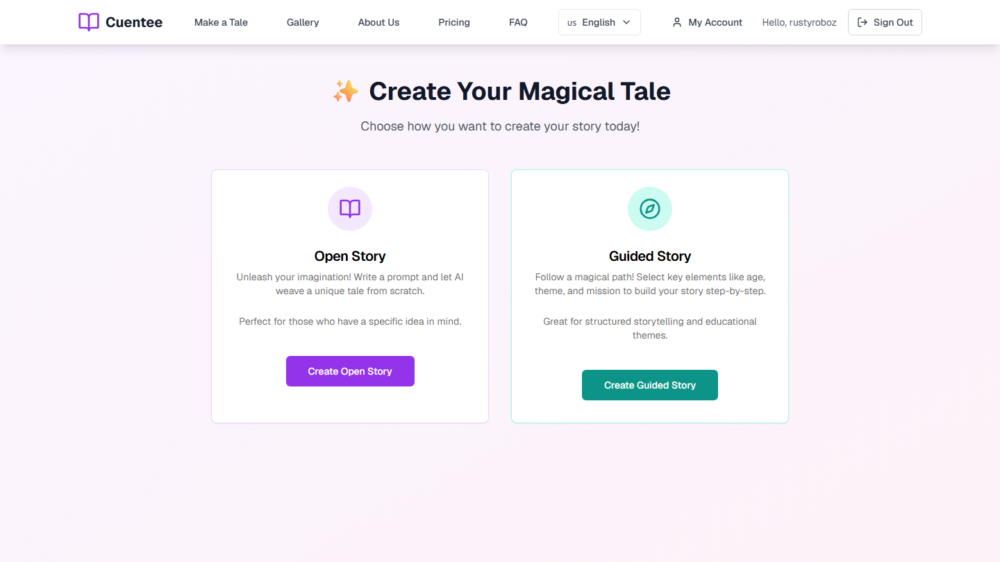
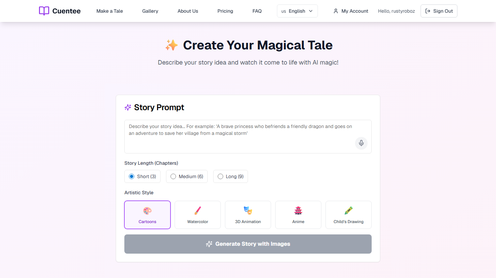
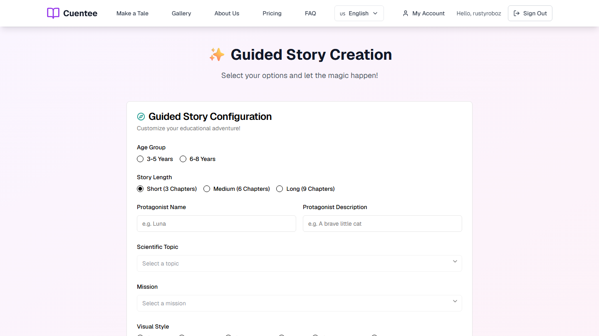

# Cuentee

AI-powered children's story generator for creating illustrated, multilingual tales.

[Live app](https://www.cuentee.com) | [Quick start](#quick-start) | [Architecture](#architecture) | [API](#api-endpoints)

## Screenshots

Screenshots were captured from `https://www.cuentee.com` on 2026-05-31 with a signed-in account.

| Home | Public gallery |
|:-:|:-:|
|  |  |

| Story modal | Story type selection |
|:-:|:-:|
|  |  |

| Open story creator | Guided story creator |
|:-:|:-:|
|  |  |

## Features

- Open story generation from a free-form prompt.
- Guided educational story generation with age group, protagonist, scientific topic, mission, visual style, language, and chapter count.
- AI-generated cover and chapter illustrations through OpenAI image models.
- Character consistency pipeline: the backend extracts character descriptions once, filters them per chapter, and injects the selected descriptions into image prompts.
- Multilingual UI and prompts for English, Spanish, French, German, Italian, and Portuguese.
- Supabase authentication with email/password and Google OAuth.
- Credit-based usage model with free credits and a `plus` plan refill job.
- Private account library, public gallery, story visibility controls, pagination, and story modal viewing.
- PDF generation and upload for generated stories.
- Optional real-time speech-to-text input through Speechmatics.

## Architecture

```text
Browser / Next.js app
  - Next.js 15 App Router
  - React 19, TypeScript, Tailwind CSS, Radix UI, Lucide icons
  - Supabase client auth and story queries
        |
        | REST + WebSocket
        v
FastAPI backend
  - /stories/generate-story-async
  - /stories/generate_guided_story_async
  - /tasks/{task_id}
  - /transcription/transcribe
        |
        | Celery task queue
        v
Celery worker + Redis
        |
        v
LangGraph story workflow
  1. Generate structured story with Groq LLaMA 3.3 70B
  2. Extract character visual descriptions
  3. Generate cover/chapter images with OpenAI image models
        |
        v
Supabase
  - PostgreSQL: stories, profiles
  - Auth: users and JWTs
  - Storage: images and PDFs
```

## Tech Stack

| Layer | Technology |
|---|---|
| Frontend | Next.js 15, React 19, TypeScript, Tailwind CSS, Radix UI, Lucide React |
| Backend | FastAPI, Python 3.11, Celery, Redis |
| Text AI | Groq `llama-3.3-70b-versatile` via LangChain |
| Workflow | LangGraph |
| Image AI | OpenAI images: `dall-e-3`, `dall-e-2`, `gpt-image-1`, `gpt-image-1-mini`, `gpt-image-1.5`, `gpt-image-2-2026-04-21` |
| Speech | Speechmatics WebSocket STT |
| Data/Auth | Supabase PostgreSQL, Auth, and Storage |
| PDFs | fpdf2 with bundled fonts |
| Deployment | Dockerfiles and Docker Compose configs for backend, worker, and frontend |

## Project Structure

```text
.
|-- api/                         FastAPI backend
|   |-- agents/                  LangGraph workflow, story schemas, image upload helpers
|   |-- celery_tasks/            Celery app and story generation task
|   |-- core/                    Environment config and auth dependencies
|   |-- prompts/                 Localized story, guided story, image, and character prompts
|   |-- routers/                 Stories, task status, and transcription routes
|   `-- services/                Supabase, user credits, and PDF services
|-- db/                          Base Supabase SQL schema
|-- docs/screenshots/            README screenshots captured from the live app
|-- frontend/                    Next.js application
|   |-- app/                     App Router pages
|   |-- components/              Forms, navigation, gallery, story modal/viewer, UI primitives
|   |-- hooks/                   Story generation polling hook
|   |-- lib/supabase/            Supabase clients and story/profile operations
|   `-- locales/                 UI translations
|-- tests/                       Pytest coverage for environment, story node, and image generation
|-- docker-compose.yml           Backend API and worker compose file
`-- .env.example                 Minimal local environment template
```

## Story Generation Flow

Open stories:

```text
Prompt + options
  -> POST /stories/generate-story-async
  -> Celery task
  -> LangGraph story generation
  -> character extraction
  -> image generation and upload
  -> PDF generation and upload
  -> Supabase story record
  -> client polls GET /tasks/{task_id}
```

Guided stories use the same Celery and LangGraph pipeline, but the backend first builds the story prompt from structured fields: age group, protagonist, scientific topic, mission, visual style, language, and chapter count.

## Character Consistency

The backend keeps character descriptions stable across images:

1. `character_extraction_node` reads the full generated story and creates concrete visual descriptions.
2. `_build_chapter_character_block` selects only the characters that appear in each chapter.
3. `make_image_prompt` appends the selected descriptions verbatim to the image prompt so they are not rewritten by another LLM call.

Preserve this invariant when editing `api/agents/story_agent.py` or `api/agents/utils.py`.

## Quick Start

### Prerequisites

- Python 3.11+
- Node.js 18+ for local frontend development
- Redis for Celery
- Supabase project
- OpenAI and Groq API keys
- Optional: Speechmatics API key for voice input

### Environment

The backend reads these variables:

```env
OPENAI_API_KEY=sk-...
GROQ_API_KEY=gsk_...
SUPABASE_URL=https://your-project.supabase.co
SUPABASE_ANON_KEY=...
SUPABASE_SERVICE_ROLE_KEY=...
SUPABASE_PROJECT_REF=your-project-ref
REDIS_URL=redis://localhost:6379/0
STORAGE_BUCKET_NAME=cuentee_images
IMAGE_MODEL=gpt-image-2-2026-04-21
SPEECHMATICS_API_KEY=...
```

The frontend reads these variables:

```env
NEXT_PUBLIC_SUPABASE_URL=https://your-project.supabase.co
NEXT_PUBLIC_SUPABASE_ANON_KEY=...
NEXT_PUBLIC_FASTAPI_URL=http://localhost:8000
```

`.env.example` is a minimal starting point; add the backend Supabase and Redis values before running generation locally.

### Backend and Worker

```bash
pip install -r api/requirements.txt
redis-server
uvicorn api.main:app --reload
celery -A api.celery_tasks.app worker --loglevel=info
```

Generation endpoints enqueue Celery tasks. Redis and the worker must be running or story generation will not complete.

### Frontend

```bash
cd frontend
npm install
npm run dev
```

The frontend runs at `http://localhost:3000` by default.

### Docker

The root `docker-compose.yml` builds the FastAPI API and Celery worker. It expects Redis and Supabase configuration through environment variables.

```bash
docker-compose up --build
```

The frontend has its own Dockerfile and compose file under `frontend/`.

## API Endpoints

| Method | Endpoint | Description |
|---|---|---|
| `GET` | `/` | Backend health check |
| `POST` | `/stories/generate-story-async` | Enqueue open story generation |
| `POST` | `/stories/generate_guided_story_async` | Enqueue guided story generation |
| `GET` | `/tasks/{task_id}` | Read Celery task status and result |
| `WS` | `/transcription/transcribe` | Speechmatics transcription WebSocket |

Story generation endpoints require a Supabase Bearer token and available credits.

## Database

The base schema in `db/schema.sql` defines:

- `stories`: generated story content, prompt, type, metadata, timestamps, and RLS policies for user-owned records.
- `profiles`: user credits, plan, plus refill timestamps, and signup trigger.

Additional SQL scripts in `frontend/scripts/` extend the deployed schema with fields and policies used by the UI, including usernames, story visibility, public gallery access, and profile fixes.

## Tests

```bash
pytest
```

Real Groq integration coverage is opt-in:

```bash
RUN_REAL_API_TESTS=true pytest tests/test_agents.py::test_real_story_generation_integration -v
```

## License

MIT
